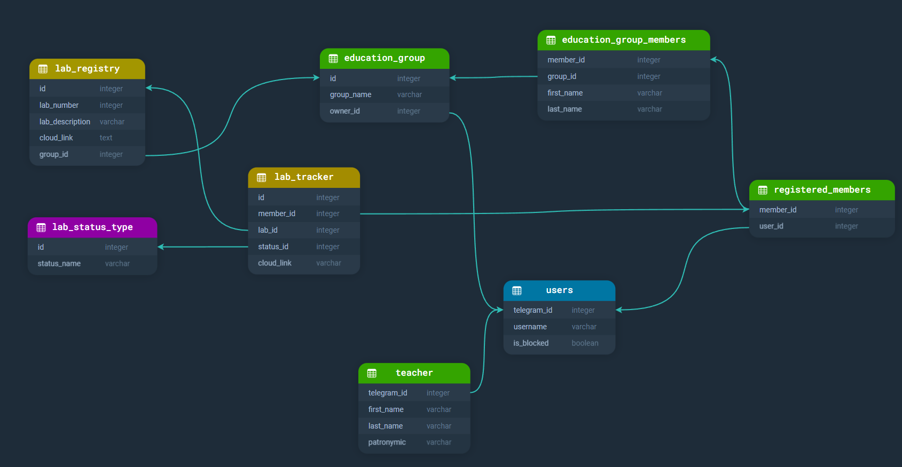

# Bfu lab checker bot

## Before start

- You need to have python 3.10 or higher, pip and venv installed
- You need to have to install [PostgreSQL](https://www.postgresql.org/download/)

# Setup

> Note: if you have installed poetry, you can skip steps 1 and 2

1. Setup Poetry <br/>

   ```bash
   pip3.10 install poetry
   ```

   or if you have python 3.10 as default

   ```bash
   pip install poetry
   ```

2. Create poetry venv<br/>

   ```bash
   poetry shell
   ```

3. Download required libs<br/>

   ```bash
   poetry install
   ```

4. Create database<br/>

   - enter postgresql console<br/>

   ```bash
   sudo -u postgres psql
   ```

   - create database<br/>

   ```sql
   CREATE DATABASE your_database_name;
   ```

   - create postgres user<br/>

   ```sql
   CREATE USER your_user_name WITH PASSWORD 'your_password';
   GRANT ALL PRIVILEGES ON DATABASE your_database_name TO your_user_name;
   GRANT ALL PRIVILEGES ON ALL TABLES IN SCHEMA public TO your_user_name;
   ```

5. Create .env file in `data/.env` and fill it with your data<br/>

   - You can use `data/.env.example` as a template<br/>

   ```bash
   mv data/.env.example data/.env
   ```

   - or just create it manually<br/>

   ```ini
   BOT_TOKEN = 'your bot token'

   #name of your database
   DB_NAME = 'your database name'
   #database user
   DB_USER = 'postgres'
   #database user's password
   DB_USER_PASSWORD = 'postgres'
   #database host, default localhost
   DB_HOST = 'localhost'
   #database port, default 5432
   DB_PORT = '5432'
   ```

6. Configure your database<br/>

   Run configuration script<br/>

   ```bash
   python database_table_configuration.py
   ```

7. Run bot<br/>
   ```bash
   python app.py
   ```

## Database structure<br/>


